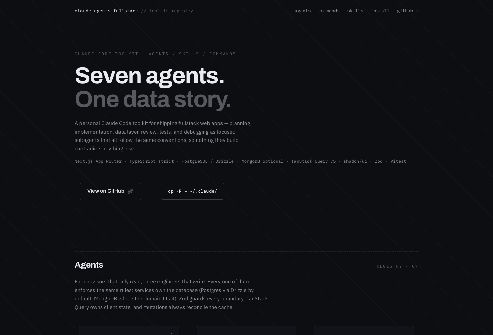

# claude-agents-fullstack

Personal Claude Code toolkit for building fullstack web apps with
**Next.js (App Router) + TypeScript + PostgreSQL (Drizzle) or MongoDB + TanStack Query + shadcn/ui**.

**🔲 Showcase:** [abdulmalekalshugaa.github.io/claude-agents-fullstack](https://abdulmalekalshugaa.github.io/claude-agents-fullstack/) — every agent, skill, and command at a glance.

[](https://abdulmalekalshugaa.github.io/claude-agents-fullstack/)

## Install (global — available in every project)

```bash
git clone https://github.com/AbdulmalekAlshugaa/claude-agents-fullstack
cd claude-agents-fullstack
./install.sh            # asks which DB is your default: PostgreSQL or MongoDB
```

Non-interactive: `./install.sh --db postgres` or `./install.sh --db mongodb`.
Both databases stay installed and supported — the choice only sets which one
new apps default to. An existing `~/.claude/CLAUDE.md` is backed up to
`CLAUDE.md.bak` first.

<details><summary>Manual install (no script)</summary>

```bash
cp -R claude-agents-fullstack/agents claude-agents-fullstack/skills claude-agents-fullstack/commands claude-agents-fullstack/templates ~/.claude/
cp claude-agents-fullstack/global-CLAUDE.md ~/.claude/CLAUDE.md
```

</details>

Or per-project: copy `agents/`, `skills/`, `commands/` into the repo's `.claude/`
directory and `templates/CLAUDE.md.template` to the repo root as `CLAUDE.md`.

## Contents

| Dir | What |
|---|---|
| `agents/` | Subagents: `planner`, `fullstack-implementer`, `data-layer-engineer`, `db-designer`, `code-reviewer`, `test-writer`, `debugger` |
| `skills/` | Stack conventions: scaffold, TanStack Query data layer, shadcn/ui, Postgres/Drizzle modeling, MongoDB modeling, API design, components, auth, testing, deploy |
| `commands/` | Slash commands: `/new-app`, `/new-feature`, `/review`, `/fix`, `/ship` |
| `templates/` | `CLAUDE.md.template` — drop into each new app repo |
| `global-CLAUDE.md` | Global preferences for `~/.claude/CLAUDE.md` |

## Data-handling conventions (the short version)

- All client-side server state lives in **TanStack Query v5** — never
  `useEffect` + `fetch`.
- Per feature module: `keys.ts` (query key factory) → `queries.ts`
  (`queryOptions` factories) → `mutations.ts` (`mutationOptions` factories),
  all calling `'use server'` actions that Zod-validate, auth-check, and
  delegate to services.
- Server components prefetch with `queryClient.query()` + `HydrationBoundary`;
  client components consume with `useSuspenseQuery`; every mutation
  invalidates its covering key prefix.
- Full spec: `skills/tanstack-query/SKILL.md`.
